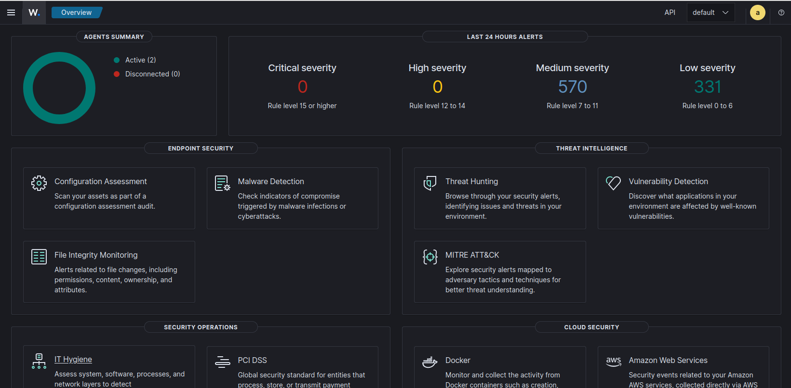
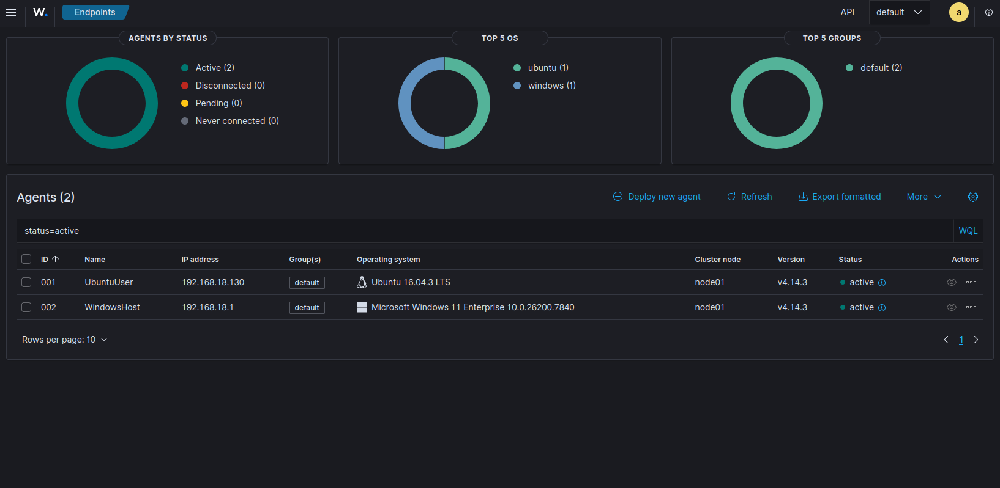
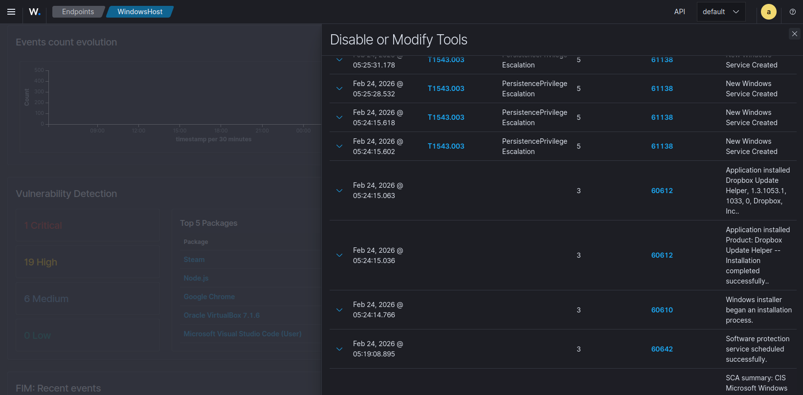
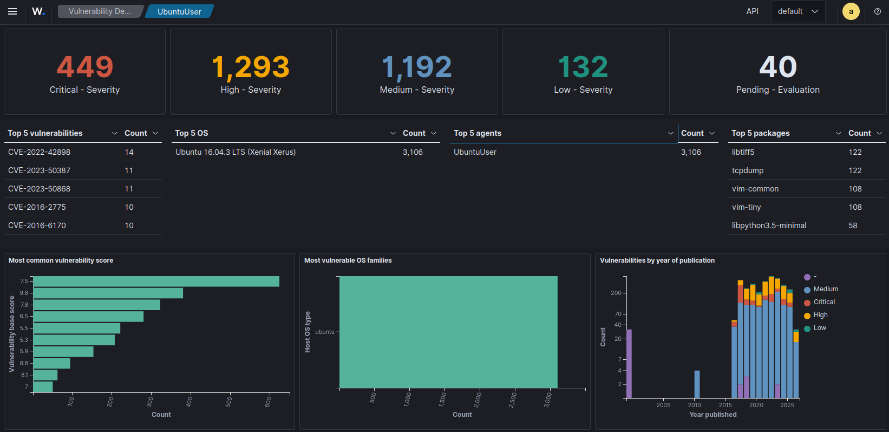
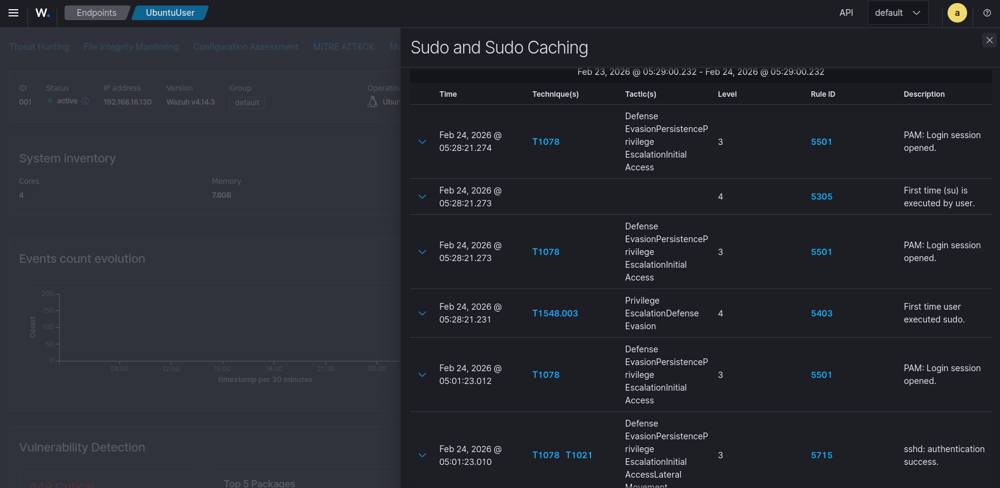

# SIEM (Wazuh) Deployment and Configuration in a Virtualized Environment (Home Lab)

## Project Description
This project involves the design, deployment, and configuration of a cybersecurity home lab environment based on **Wazuh** (an open-source SIEM and XDR platform). The main objective was to create a controlled environment to monitor security events, detect vulnerabilities, and audit file integrity (FIM) across multiple operating systems.

## Network Architecture and Environment
The lab was built using **VMware Workstation** for virtualization, segmented into the following nodes:

* **SIEM Server (Manager, Indexer, Dashboard):** Ubuntu 20.04 LTS (4 vCPUs, 8GB RAM, 55GB Disk).
* **Endpoint 1 (Linux Agent):** Ubuntu user machine.
* **Endpoint 2 (Windows Agent):** Windows user machine.

## Technologies Used
* **Security Platforms:** Wazuh (SIEM/XDR), OpenSearch, Filebeat.
* **Operating Systems:** Linux (Ubuntu 20.04 LTS), Windows 10.
* **Tools & Scripting:** Bash, PowerShell, SSH, `dpkg`/`apt` package managers, Linux CLI.
* **Virtualization:** VMware Workstation.

## Deployment Phases

### 1. Wazuh Server Deployment (All-in-one)
An automated server installation was performed on Ubuntu using the official Wazuh script.

### 2. Agent Configuration (Linux and Windows)
Agents were configured on the different endpoints to send telemetry to the central server.
* **Ubuntu Endpoint:** Installed via Bash script, enabling the daemon and registering the machine with the Manager.
* **Windows 10 Endpoint:** Deployed via administrative PowerShell, configuring the `wazuh-agent` service for automatic startup.

## Proof of Concept and Use Cases (Detections)
Once the infrastructure was set up, activity was simulated on the endpoints to test the SIEM's detection capabilities.

### File Integrity Monitoring (FIM) on Windows
The agent was configured to audit changes in the Windows file system and registry.

### Vulnerability Detection and CIS Benchmarks
The SIEM automatically audited the software status of the agents, cross-referencing installed packages with CVE databases.

### MITRE ATT&CK Monitoring (Privilege Escalation)

## Troubleshooting
During the low-level deployment on the Linux server, I encountered severe package manager corruption and network conflicts, which were resolved by applying advanced system administration knowledge:

1. **Port Conflict (Zombie OpenSearch/Elasticsearch):** * **Issue:** The installation failed because TCP ports 9200 and 9300 were blocked.
   * **Solution:** I used `ss -tulpn | grep -E ':9200|:9300'` to locate the PID of the residual Java process from a failed attempt and forcefully terminated it using SIGKILL signals (`kill -9`).

2. **Package Manager Corruption (`dpkg exit status 127`):**
   * **Issue:** The pre-removal script (`wazuh-manager.prerm`) became corrupted, causing an infinite loop that prevented `apt` and `dpkg` from installing, deleting, or updating any system packages.
   * **Solution:** I accessed `/var/lib/dpkg/info/`, renamed the corrupted scripts (`.prerm` and `.postrm`) to "blind" the package manager, and forced the removal of the damaged database with `dpkg --remove --force-remove-reinstreq`, restoring operating system health and allowing a clean installation.

## Key Learnings
* Practical knowledge of corporate SIEM/XDR architecture.
* Event correlation and alert mapping using the MITRE ATT&CK framework.
* Advanced Linux system administration (handling broken dependencies, process and service management with `systemctl`).
* SSH connection configuration for remote administration (Headless Server).

*Documentation created by Anas Rami*
